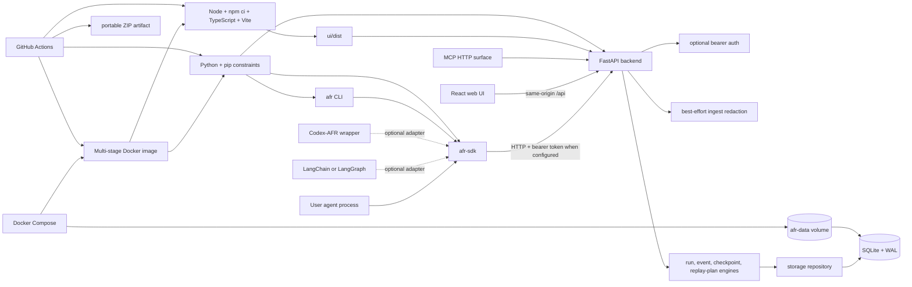

# Agent Flight Recorder dependency map

This map describes the supported runtime, build, integration, and delivery paths for Agent Flight Recorder (AFR). The goal is to keep the local recorder small while making the complete product easy to run.

## System map



## Runtime dependency layers

| Layer | Direct dependencies | Depends on | Failure impact | Containment |
| --- | --- | --- | --- | --- |
| Browser UI | React, React DOM, React Router | Same-origin backend under `/api` | Inspection UI unavailable; recorder data remains intact | Health indicator, request timeout, retry, downloadable JSON bundle |
| CLI | `afr-sdk` | Backend HTTP API | Terminal workflows unavailable; backend and UI continue | Installed in the Docker image and Python install path |
| Python SDK | `httpx` | Backend HTTP API | New events cannot be recorded through Python | Bounded HTTP client, optional framework adapters kept outside core |
| Backend API | FastAPI, Uvicorn | Engine, schemas, storage | All reads and writes stop | Localhost binding by default, health check, restart policy |
| Engine | Python standard library and AFR modules | Storage repository | Affected run/replay operation fails | Replay stays opt-in; backend prepares plans but does not execute user code |
| Storage | Python `sqlite3` | Local filesystem or Docker volume | Run history unavailable or at risk if the file is lost | WAL mode, schema migrations, persistent named volume |
| Optional LangChain adapter | `langchain-core` | SDK | Only that integration is unavailable | Optional dependency extra; plain Python remains usable |
| UI build | Node, npm, TypeScript, Vite | Locked `package-lock.json` | New UI assets cannot be built | Multi-stage Docker build and CI both run `npm ci` |
| Python build | pip, setuptools | Manual direct-version constraints | Install or image build fails | All supported install paths consume `backend/requirements.txt` and run `pip check` |

## Delivery paths

### Recommended: Docker Desktop

```text
source or portable ZIP
        |
        v
docker compose up --build
        |
        +-- Node build stage -> ui/dist
        +-- Python runtime -> backend + SDK + CLI
        +-- localhost port 8700
        +-- persistent afr-data volume
```

No host Python or Node installation is required. The image contains the web UI, backend, SDK, and CLI. The root launchers wrap this path and wait for the health check before opening the browser.

### Local developer path

```text
make install   -> .venv with backend + SDK + CLI
make build-ui  -> locked UI build in ui/dist
make run       -> FastAPI serves both /api and ui/dist
```

This path is intended for contributors who already have Python 3.10+ and Node installed.

### Portable CI bundle

Every successful pull request produces `agent-flight-recorder-portable.zip`. It includes the repository plus prebuilt `ui/dist` assets. This supports both the Docker path and a Python-only local run without requiring Node at runtime.

## Data and trust boundaries

- AFR records observable execution evidence supplied through its SDK, API, CLI, or adapters. It does not recover hidden model reasoning or unrecorded internal state.
- Prompts, tool payloads, outputs, and state snapshots may contain sensitive information. Redaction is best-effort and the SQLite database must be treated as sensitive.
- The default network boundary is `127.0.0.1:8700`. Set `AFR_API_TOKEN` before deliberately exposing AFR beyond loopback.
- Replay is disabled by default. The backend reconstructs state and prepares a plan; execution remains the responsibility of an explicitly registered user handler.

## Weaknesses and current mitigations

| Weakness | Why it matters | Mitigation in this delivery pass | Residual risk |
| --- | --- | --- | --- |
| UI, backend, SDK, and CLI had separate setup paths | A successful backend start could still leave the user without the product UI or CLI | Multi-stage image now ships all four layers | First image build still downloads base images and packages |
| Documented `make build-ui` target did not exist | Contributor instructions were not executable | Added locked UI build, complete `make run`, and static contract tests | Host developer path still needs Node |
| UI CI was intentionally quarantined | Type or build regressions could reach `main` | Restored TypeScript/Vite build as a required CI job | No browser end-to-end suite yet |
| Releases contained no runnable asset | Downloading source did not communicate a clear launch path | Cross-platform launchers and CI portable ZIP | CI artifacts expire; durable release assets still require a tagged release |
| Browser requests had no timeout or service health signal | An offline backend looked like an indefinitely broken page | Health badge, bounded requests, retry, manual refresh, and refresh pause | A local firewall or proxy can still interfere |
| Run list was desktop-table-first and click-only | Small screens and keyboard navigation were poor | Responsive card layout, focus states, keyboard row activation, reduced-motion support | Formal screen-reader testing remains to be done |
| UI could inspect but not preserve a run | Users had to switch to the CLI for a portable incident | Added one-click local JSON bundle download | The browser bundle is not signed and does not include external attachments |
| UI renders up to 10,000 events at once | Very large runs can consume substantial browser memory | Search and clearer controls improve triage | Pagination or virtualization is still needed for truly large runs |
| Python file pins are not a full hash-locked graph | Transitive resolution can change between clean installs | All paths share constraints and run `pip check`; the limitation remains documented | A generated, hash-verified lock is still recommended |
| SQLite is intentionally single-node | Concurrent high-volume writers or remote teams will outgrow it | WAL mode and local-first scope are explicit | Multi-user storage would require a separate deployment architecture |

## Next dependency-hardening priorities

1. Generate and verify a hash-locked Python dependency graph in a controlled update workflow.
2. Add browser end-to-end tests for onboarding, run inspection, export, and replay-plan preparation.
3. Add event pagination or windowed rendering before positioning AFR for very large traces.
4. Publish signed, versioned release assets and a prebuilt container image from tagged releases.
5. Add documented backup and restore commands for the SQLite volume.
